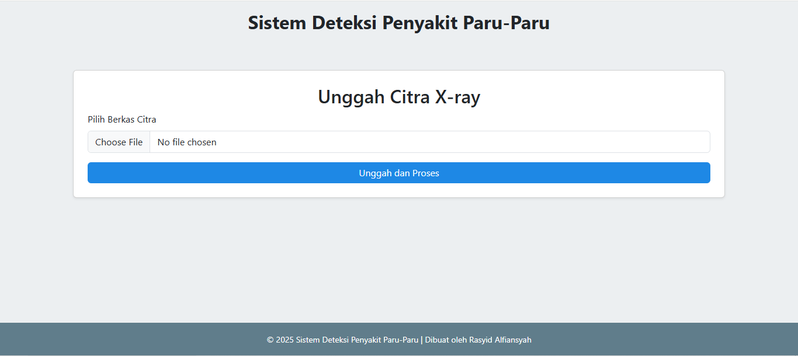

# skripsi-model-deployment-flask-lung-disease-detection

Repositori untuk deployment model skripsi berbasis dashboard website menggunakan Flask.

## Deteksi Penyakit Paru-Paru dari Citra X-Ray Menggunakan Segmentasi U-Net dan Klasifikasi CNN

Berdasarkan hasil penelitian, model yang dibuat telah berhasil melakukan deteksi penyakit paru-paru dari citra X-ray dengan baik.  
- **Model U-Net** berhasil mencapai **nilai Intersection over Union (IoU) sebesar 91,69%**, menunjukkan kinerja yang baik dalam melakukan segmentasi region paru-paru.  
- **Model CNN** menunjukkan **akurasi sebesar 95,70%**, mencerminkan performa yang baik dalam melakukan klasifikasi **COVID-19, pneumonia, tuberculosis, dan paru-paru normal**.  

### Perbandingan Performa Model CNN dengan Transfer Learning

| Model            | Waktu Pelatihan | Loss  | Akurasi  |
|-----------------|---------------|------|--------|
| CNN yang diajukan | 756.85 s       | 0.2214 | **95.70%** |
| MobileNetV2      | 904.26 s       | 0.1539 | **95.70%** |
| Xception        | 687.54 s       | 0.2086 | 92.62% |
| VGG19           | 1660.99 s      | 0.1721 | 94.06% |

### Akurasi Perkelas (Recall) Tiap Model

| Model            | Normal | Tuberculosis | Pneumonia | COVID-19 |
|-----------------|--------|--------------|-----------|----------|
| CNN yang diajukan | **96.25%** | 96.88% | **97.09%** | 87.93% |
| MobileNetV2      | 94.37% | **100.00%** | 95.63% | **94.83%** |
| Xception        | 91.25% | 96.88% | 93.69% | 87.93% |
| VGG19           | 94.37% | 93.75% | 97.09% | 82.76% |

---

## Aplikasi Web

Prototipe sistem diimplementasikan dalam bentuk aplikasi berbasis website menggunakan **Flask** sebagai backend dan **Jinja** sebagai template engine.  

Fitur utama aplikasi:
- Upload gambar X-ray untuk analisis penyakit paru-paru.
- Melakukan segmentasi paru-paru dengan model **U-Net**.
- Melakukan klasifikasi penyakit paru-paru (Normal, Tuberculosis, Pneumonia, COVID-19) dengan **CNN**.
- Menampilkan hasil segmentasi dan prediksi secara visual di dashboard.

Berikut adalah tampilan antarmuka aplikasi:

1. **Halaman Awal**  
   

2. **Halaman Hasil**  
   

---

Cara Menjalankan Proyek

1. Clone Repository
```bash
git clone https://github.com/username/skripsi-model-deployment-flask-lung-disease-detection.git
cd skripsi-model-deployment-flask-lung-disease-detection

2. Buat Virtual Environment
python -m venv venv
source venv/bin/activate  # Untuk Linux/macOS
venv\Scripts\activate     # Untuk Windows

3. Install Dependencies
pip install -r requirements.txt

4. Jalankan Aplikasi Flask
python app.py

Aplikasi akan berjalan di http://127.0.0.1:5000/.
