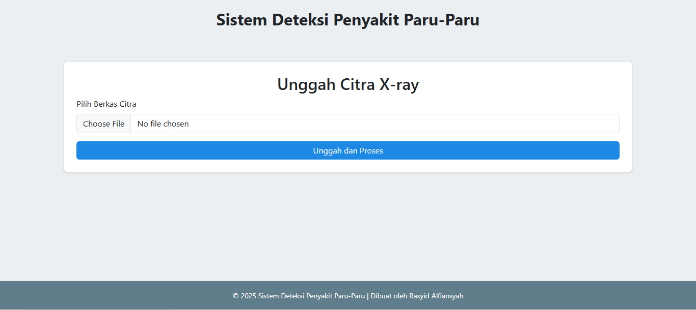
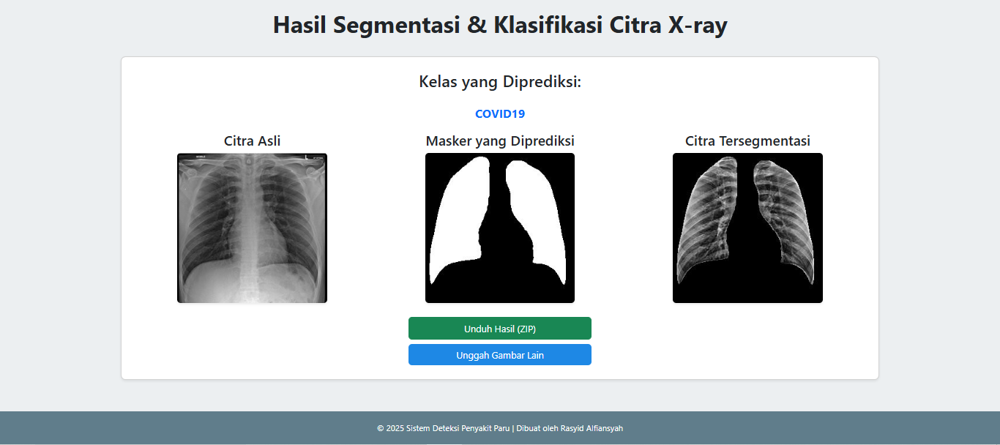

# skripsi-model-deployment-flask-lung-disease-detection

## Aplikasi Web

Prototipe sistem diimplementasikan dalam bentuk aplikasi berbasis website menggunakan **Flask** sebagai backend dan **Jinja** sebagai template engine.  

Fitur utama aplikasi:
- Upload gambar X-ray untuk analisis penyakit paru-paru.
- Melakukan segmentasi paru-paru dengan model **U-Net**.
- Melakukan klasifikasi penyakit paru-paru (Normal, Tuberculosis, Pneumonia, COVID-19) dengan **CNN**.
- Menampilkan hasil segmentasi dan prediksi secara visual di dashboard.

Berikut adalah tampilan antarmuka aplikasi:

1. **Halaman Awal**  
   

2. **Halaman Hasil**  
   

---

## Cara Menjalankan Proyek

```bash
# 1. Clone Repository
git clone https://github.com/username/skripsi-model-deployment-flask-lung-disease-detection.git
cd skripsi-model-deployment-flask-lung-disease-detection

# 2. Buat Virtual Environment
python -m venv venv
source venv/bin/activate  # Untuk Linux/macOS
venv\Scripts\activate     # Untuk Windows

# 3. Install Dependencies
pip install -r requirements.txt

# 4. Jalankan Aplikasi Flask
python app.py
